# Introduction

Team Members:

Kai Mo (kam455@pitt.edu)

Quan Liu (qul16@pitt.edu)

Jie Chen (jic136@pitt.edu)

Tianqi Xie (tix19@pitt.edu)

This is a Movie review website which provides movie information and welcomes user to leave comments for each movie.  [Fresh Potatoes](https://freshpotatoes.herokuapp.com/)

# Objective

## Sign up

On this page, users can sign up with email, password and user name.

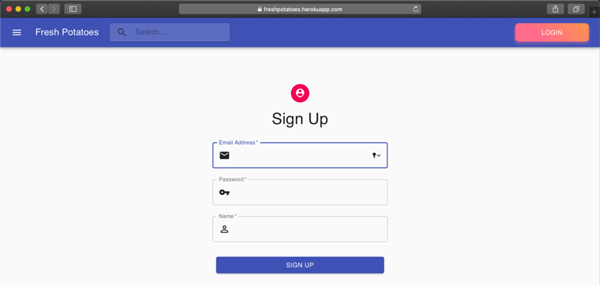

## Login
Users can log in on this page, visitors can also direct to sign up page in this page.

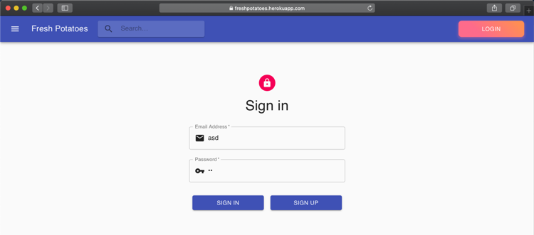

If the email address typed in is not in the right format, the page will show error message.

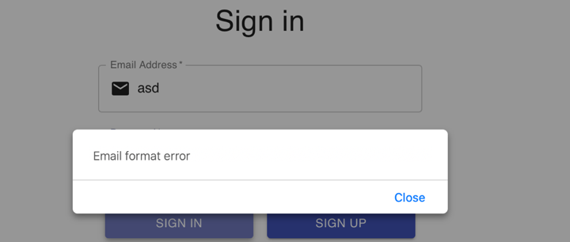

Also, if the email address or password is wrong, the page will also show related error message.

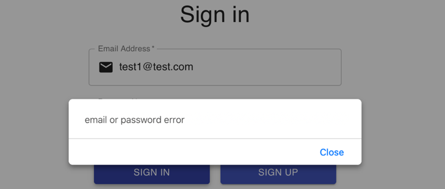

## HomePage

On the navigation bar, we have mini list on left side that can direct us to home page and movie list page, we also have search function that can redirect users to the movie list page based on the word they typed. We also have login function on the right side, after the user logged in, it will change to a mini list button with user name on it.

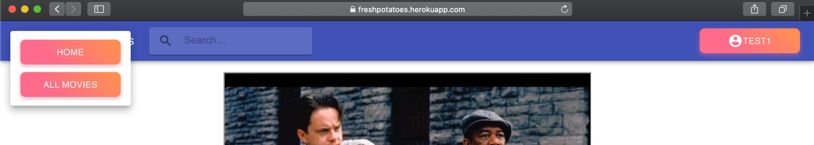
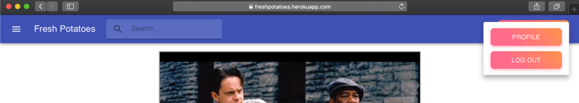

There’re three top movie trailers, and we can watch each trailer by click the play button. We can also click the detail button to see the detail of each movie.

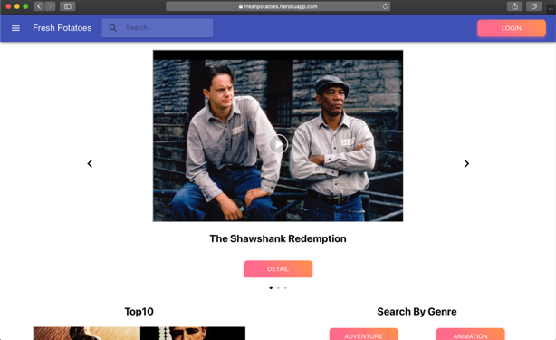

we can see Top10 movies on the left side, we can see each movie’s detail page by click the small info button. The right side are the whole genres, we can see the movie list in each genre by click each button.

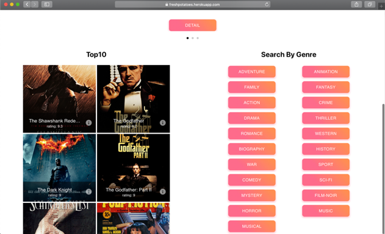

## Profile

On this page, users can see their own name and email, they can also manage their comments. Normal users can only manage their own reviews, but admin users can manage all comments in the database. They can delete certain comments that contains certain word.

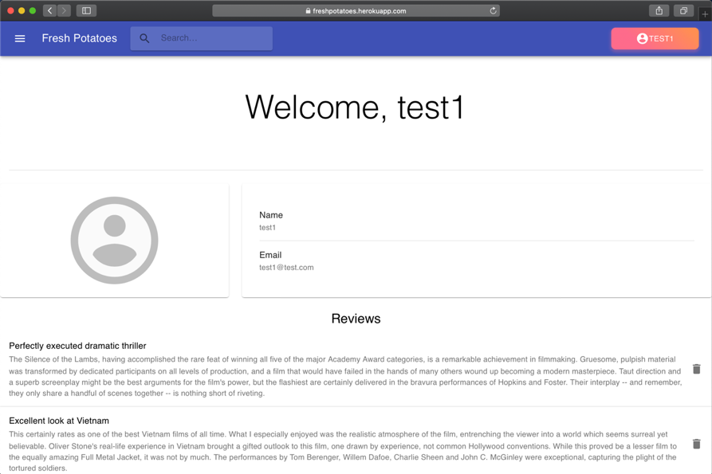

## Movie Detail

This page shows the movie detail information including name, genre, actors, directors, trailer, rating and so on. This page also includes the reviews.

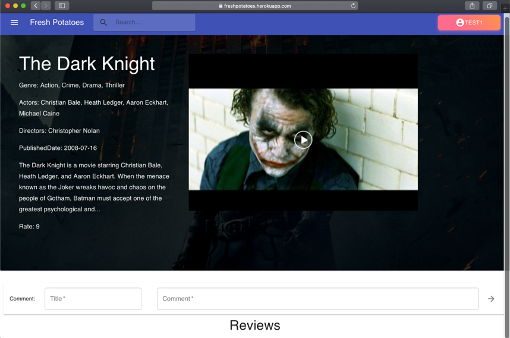

## Review

Visitors cannot leave comment without login

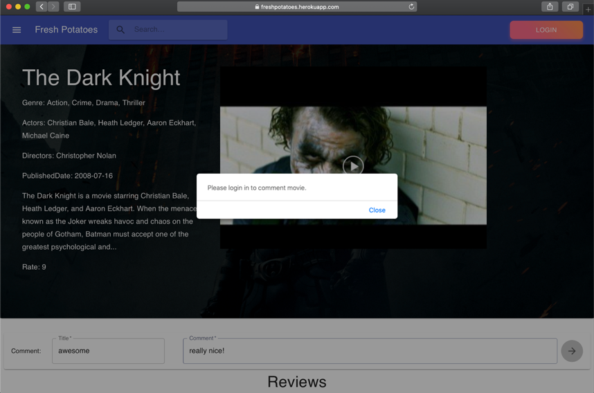

## MovieList

This page shows all movies in our database, if user is redirected to this page by using the search function, the movies showed will base on the searching result.

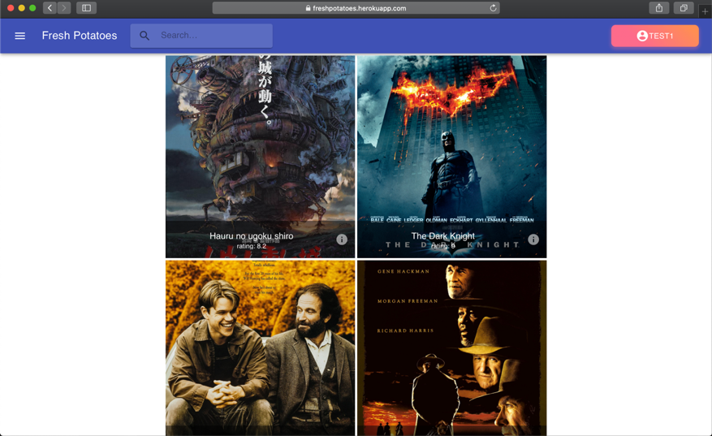

# Team members contribution

Frontend: Kai Mo, Quan Liu.

Backend & Database: Jie Chen, Tianqi Xie

Deployment & Data Crawler & Azure: Jie Chen

# Technical Architecture

 For this project, we use MERN stack, which is composed of MongoDB, Expressjs, Reactjs and Nodejs. MongoDB is used as database, Reactjs is used as frontend, and Expressjs and Nodejs are used as backend.
 
 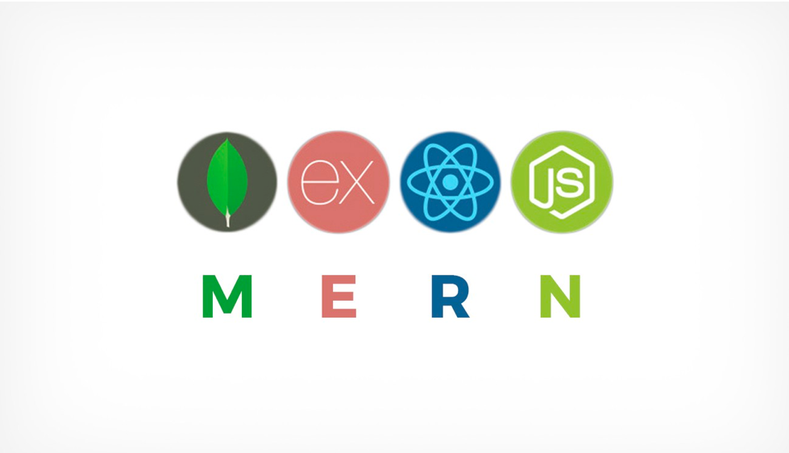

 The diagram below shows the working process of our website. For example, when a user wants to login in our website, the client side will send a request and the server side will create a unique Token and send it with response, then this token will be stored in frontend session storage. After that, client side need to send the request with the token back to server side. Once the client side sent request without token, we can assume that the user has already logged out. We use this way to maintain user's loggin status is because we use RESTful architecture style, which is stateless.  

In order to automatically update the database instead of manually, we decide a strategy to do this. The Azure function is a serverless service FaaS, which supports many programming languages like Python, C# and Java. We wrote a Python script to crawling movie data from IMDB and deployed to Azure function. After that, the Azure funtion generated a url that we can use in logic App, which is cloud server that helps us to build workflows. In our project, the logic app will triggered by `Recurrence` and we set the `interval` to `1 day`, so that the logic app will be triggered every day. Once the logic app is triggered, it will send a HTTP `GET` request to the url, which is generated for our Azure function, and this function will start to update our database.

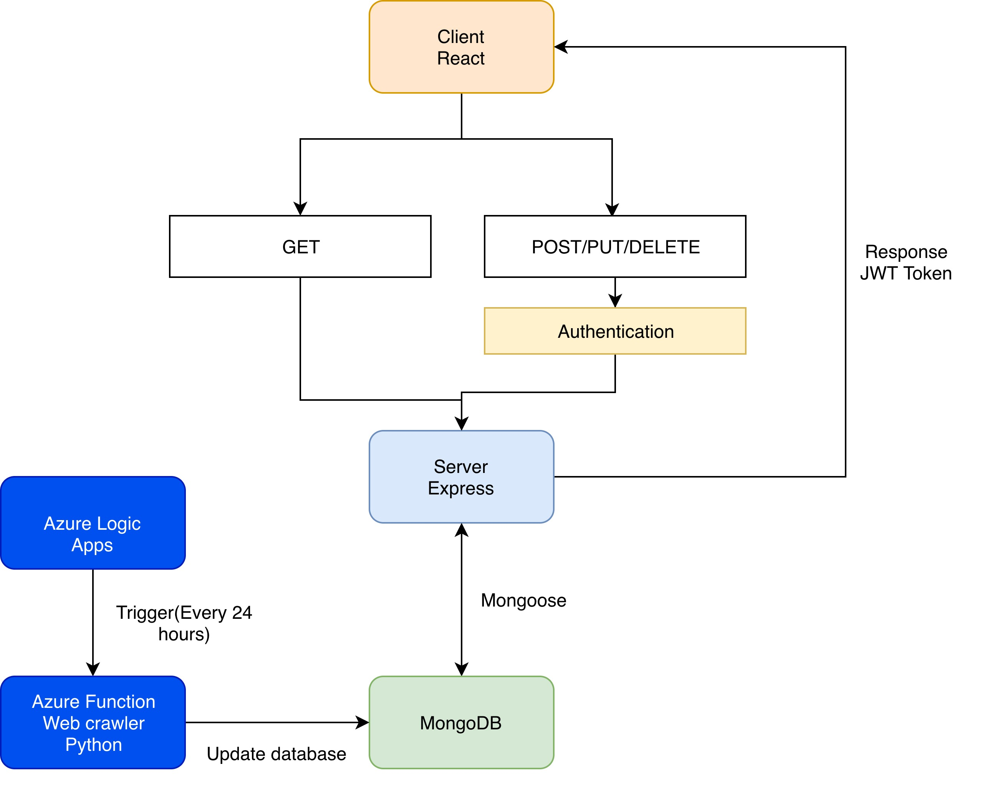

## technologies that we used

For Frontend:

- HTML
- CSS
- JavaScript
- NodeJS
- ReactJS
- JSX
- Babel, Webpack (integrated in react-script)
- MaterialUI

For Backend:

- NodeJS
- ExpressJS
- PassportJS
- Bcrypt (a library used to encrypt and decrypt password)
- Mongoose

Azure:

- App service
- Azure functions
- Logic Apps

# Challenges

For Frontend:

1. User Authentication. Solution: Use the token send by server to authorize user login status, and then store it in session storage
2. Render React components based on data send by server.  Solution: Due to the particularity of the React component, we need to use componentDidMount() to make sure the component will be re-rendered after fetching data

For Backend:

1. User Authentication. Solution: use `passport-jwt` to generate the token.
2. Auto update database(add movie). Solution: use Azure function and logic app.

# Future work

1. Add notification function.
2. Allow user upload avatar.
3. Add reset password function.

# Conclusion

We have learned a lot from this course. First of all, we learned how to design endpoints and build fully RESTful backend from this class. Second, we learned how to use mongoose to define schema and manipulate MongoDB from this class. Third, we learn how to use frontend framework (react) from project 2, which provides many benefits for this project.

# Documentation

https://material-ui.com/styles/api/

https://www.npmjs.com/package/react-slideshow-image

https://stackoverflow.com/

https://reactjs.org/docs/react-api.html
https://material-ui.com/styles/api/

https://stackoverflow.com/

https://expressjs.com/en/4x/api.html

https://expressjs.com/en/guide/routing.html

https://mongoosejs.com/docs/queries.html

https://medium.com/quick-code/handling-authentication-and-authorization-with-node-7f9548fedde8

https://medium.com/swlh/jwt-authentication-authorization-in-nodejs-express-mongodb-rest-apis-2019-ad14ec818122

https://www.imdb.com/chart/top/?ref_=nv_mv_250

https://faker.readthedocs.io/en/master/

https://blog.heroku.com/deploying-react-with-zero-configuration